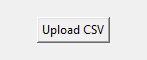
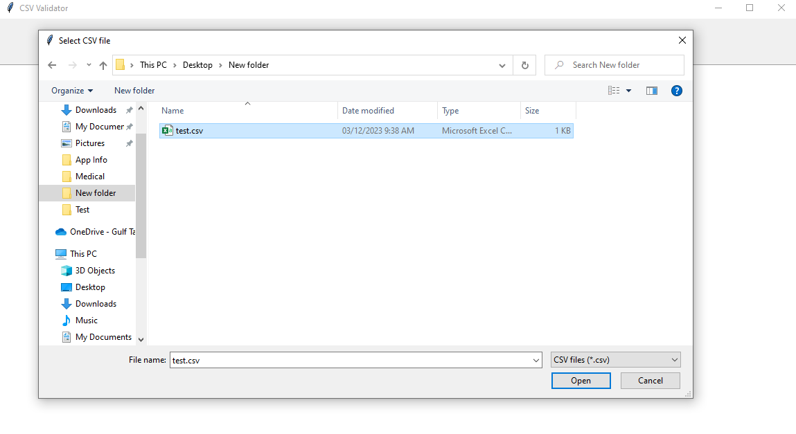
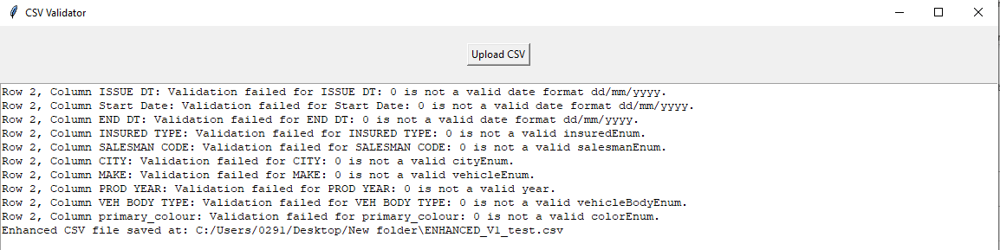
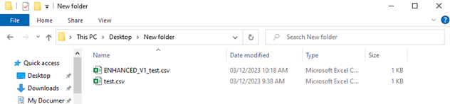

## The Validation:

- <u>Mandatory</u> fields will demand a value and will not accept a blank field, can accept 0 in some cases.
- Fields that are static and are always filled with a predefined value are automatically filled with scripted values regardless of the values given by the csv, they will **override** the original values.
- Date formats that are “dd - mm - yyyy” or “dd-mm-yyyy” are automatically fixed to ”dd/mm/yyyy”.
- Fields that expect integer like “123” will not accept any type of symbol including decimals like “12.3”.
- Fields that expect a decimal value like “12.3” will accept any number but will not accept letters or other symbols.
- “commission_percentage” and “commission_amount” fields are only <u>mandatory</u> if “Broker Account” is provided, otherwise they’re automatically set to 0.
- “commission_amount_for_the_next_year_for_agent” field is only <u>mandatory</u> if “Broker Account” is provided and “long_term_flag” is set to 1, otherwise it is set to 0.
- “CONDITION” field expects a string like “1/ 2/ 3” and so on so long the numbers are part of the condition list, otherwise should be “0”.

## The Process:

1. Open the executable file.

    

2. Click on “Upload CSV” button, opens a file browser allowing the user to navigate to their desired file.

    
    

3. On file selection, the script validates the file and creates a new modified file in the same folder as the original file.
4. The new file will be named like the old file with the prefix “ENHANCED_V1_”, so if a file was named “test.csv” the enhanced file will be called “ENHANCED_V1_test.csv”. If the original file was named “ENHANCED_V1_test.csv” the enhanced file would be named “ENHANCED_V2_test.csv” and so on.
5. In case any errors were found and couldn’t be automatically corrected, the system will out put an error message for each error. Each error message will show row number, column name and a brief description of what went wrong.

    

6. After validation is completed, the last message that will confirm the enhanced file was saved and shows the location it was saved in.

    

These are the general steps to follow for the app to work properly, ensure the csv file is following the [template](UploadTemplate.csv).

The script will only work if the csv files **contained the column names** in the [template](UploadTemplate.csv). Avoid extra columns or less columns just to be safe.
If no message is shown and no new file is generated, that means the app crashed.

# Not working as expected?

In addition to the information mentioned previously, here are the steps to ensure that the app works as planned:

1. Make sure that the first row of the datasheet contains the exact column names from the [template](UploadTemplate.csv) with the same order.
2. Change the Civil ID column type to Number without decimal values.
3. If you have too many date fields that are complaining about formatting, simply open the CSV file with Excel and make sure the date columns are [formatted correctly](#the-validation).

If it looks good, press Save and try again.